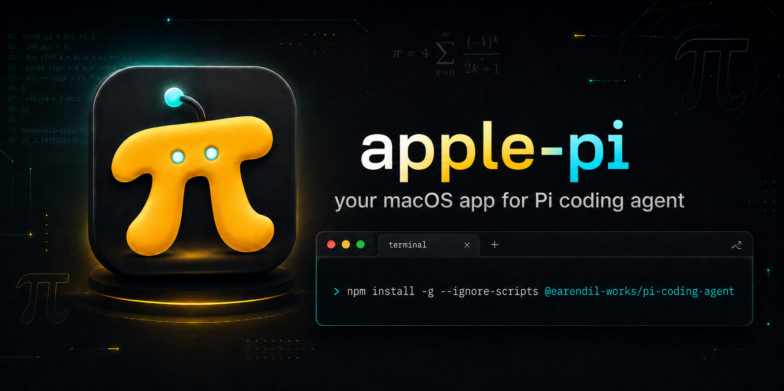

<div align="center">

# Apple Pi

**You already have Pi. Now give it a proper macOS home.**

*A minimal native macOS app for running [Pi](https://github.com/earendil-works/pi) coding-agent terminal sessions — locally or over SSH.*

</div>

<p align="center">
  
</p>

<br>

<div align="center">

**Projects on the left. Sessions in the middle. Terminals on the right, for the agents doing the work.**

No chat feed. No fake IDE. No Electron wrapper.

**Just Pi, terminals, and a cockpit that feels good to use.**

</div>

<p align="center">
  
</p>

---

## What it is

Pi is powerful. The terminal chaos around it is not.

**Apple Pi** is the native macOS room you put Pi in. It keeps what is already great, the terminal, and gives it structure: a session browser, a project list, a workspace that stays oriented so you do not have to.

## What it does

Browse your Pi `.jsonl` sessions, resume them with one click, fork a session into a parallel path, open fresh sessions per project, or start ephemeral ones when you want a clean run.

Each tab is a real terminal backed by **SwiftTerm**. Parallel agents feel natural because they are not trapped inside a custom chat UI pretending to be one.

Local sessions can send a macOS notification when Pi is ready for your input again. The app bundles the small helper this needs and loads it only for sessions it starts. Your existing Pi agent settings are left exactly as they are.

Run your local Pi with the configured `pi` executable, or connect to a remote machine over your existing SSH setup. No new password store.

Remote SSH mode can browse, start, and resume sessions on the remote host. It intentionally does not delete remote session files from the app, and the Pi context panel stays limited because project trust and local file actions belong to the remote machine.

## Make it yours

Tune the opacity of the window, sidebars, and terminal surface. Pick an accent color. Adjust the terminal font. Keep the titlebar transparent, or do not.

A clean terminal cockpit floating over your desktop is a legitimate aesthetic. The app will not fight you on it.

## Session discovery

**Apple Pi** looks where Pi already keeps sessions:

```sh
~/.pi/agent/sessions
```

If you changed Pi's session directory, the app follows that. Environment overrides, global settings, trusted project settings: all supported.

Pi owns the sessions. Apple Pi makes them easier to find, read, start, and resume.

## What it is not

Apple Pi is not a replacement for Pi, a chat app, an IDE, an Electron dashboard, a cloud service, an account system, a model API key manager, or an SSH key manager.

## Install

Download the release zip, unzip it, move the app to `/Applications`:

```sh
shasum -a 256 "apple-pi-<version>-<build>.zip"
ditto -x -k "apple-pi-<version>-<build>.zip" /tmp/apple-pi
mv "/tmp/apple-pi/Apple Pi.app" /Applications/
```

macOS may warn that the app cannot be verified. That is expected: this is an open source project and I am not paying Apple $99/year to make that dialog disappear. Launch once, then go to **System Settings -> Privacy & Security -> Security** and click **Open Anyway**.

The trust model: inspect the source, verify the release hash, build it yourself if you want the strongest guarantee.

Full details are in [Install](docs/INSTALL.md) and [Verify An Install](docs/VERIFY_INSTALL.md).

## Build

```sh
swift test
swift run ApplePi
VERSION=0.1.0 BUILD_NUMBER=1 script/package_release.sh
```

The package script creates the `.app`, ad-hoc signs it, verifies it, and writes a versioned zip into `dist/`. Release maintainers should follow [Release Checklist](RELEASE_CHECKLIST.md) and [Release Process](docs/RELEASE_PROCESS.md).

## Trust, but verify

No analytics. No account. No background auto-updater.

On launch, the app makes one anonymous GET to `api.github.com/repos/dodo-reach/apple-pi/releases/latest` to check for newer releases, throttled to once every 24 hours, and shows a small in-app link if one exists. It never downloads or installs anything on its own.

No bundled browser runtime. No SSH key manager. No password store. No model API key manager. No hidden Pi installs.

```sh
codesign --verify --deep --strict --verbose=2 "Apple Pi.app"
codesign --display --verbose=4 "Apple Pi.app"
plutil -p "Apple Pi.app/Contents/Info.plist"
```

[Security](SECURITY.md), [Privacy](PRIVACY.md), and [Third-Party Notices](THIRD_PARTY_NOTICES.md) if you want to know exactly what you are installing.

## Requirements

- macOS 14 or newer
- Pi installed locally, or SSH access to a remote host running Pi
- Swift 6.1 if building from source
- `python3` on the remote host for remote session browsing

## License

MIT. See [LICENSE.md](LICENSE.md).

SwiftTerm is MIT licensed, included in [Vendor/SwiftTerm](Vendor/SwiftTerm).
